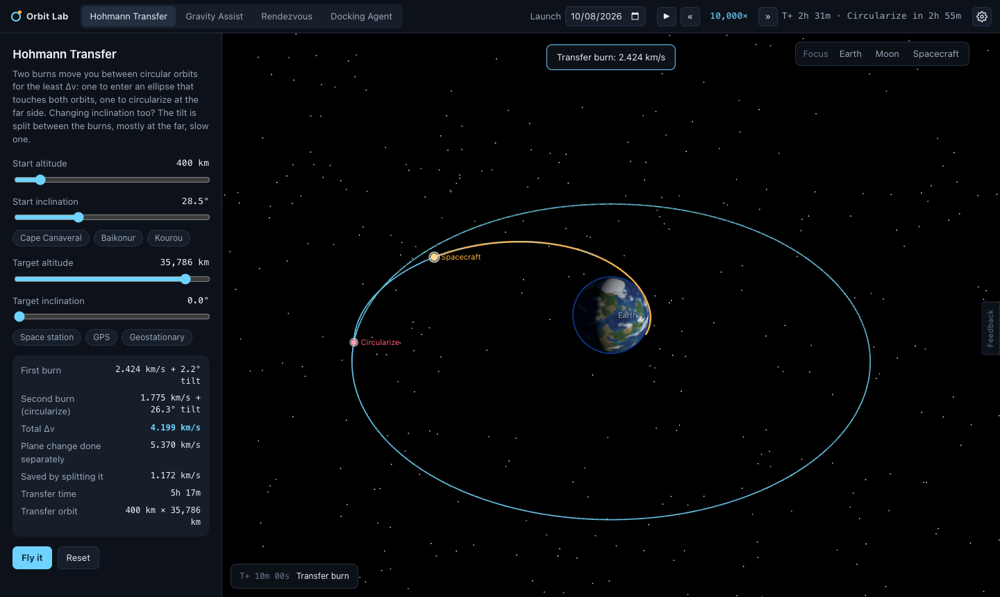
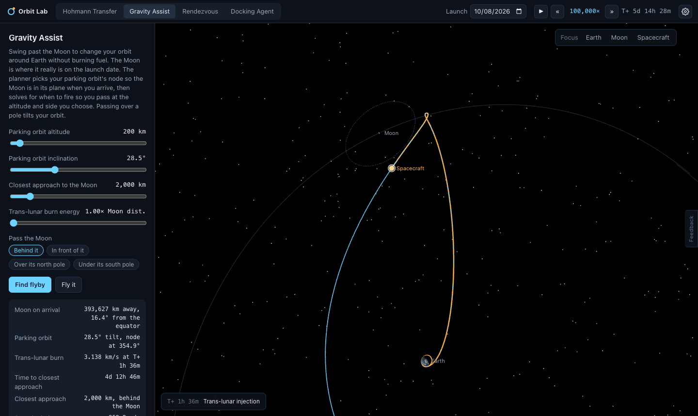
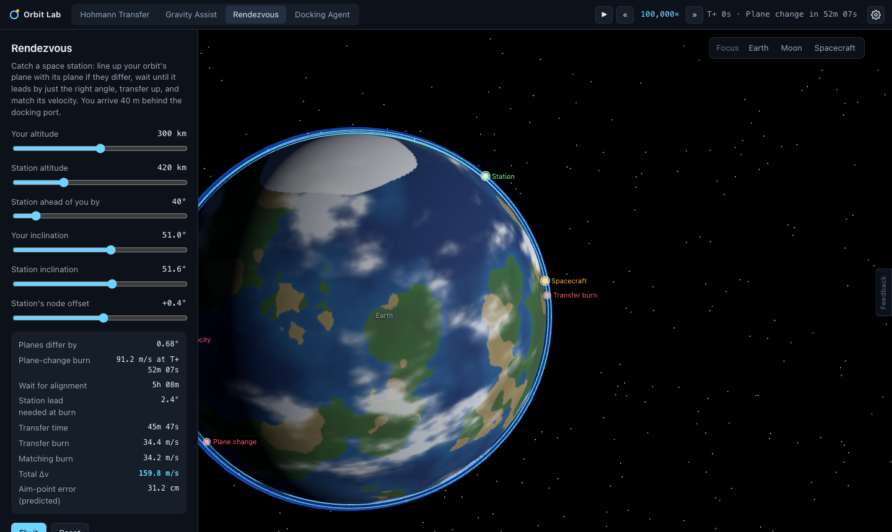
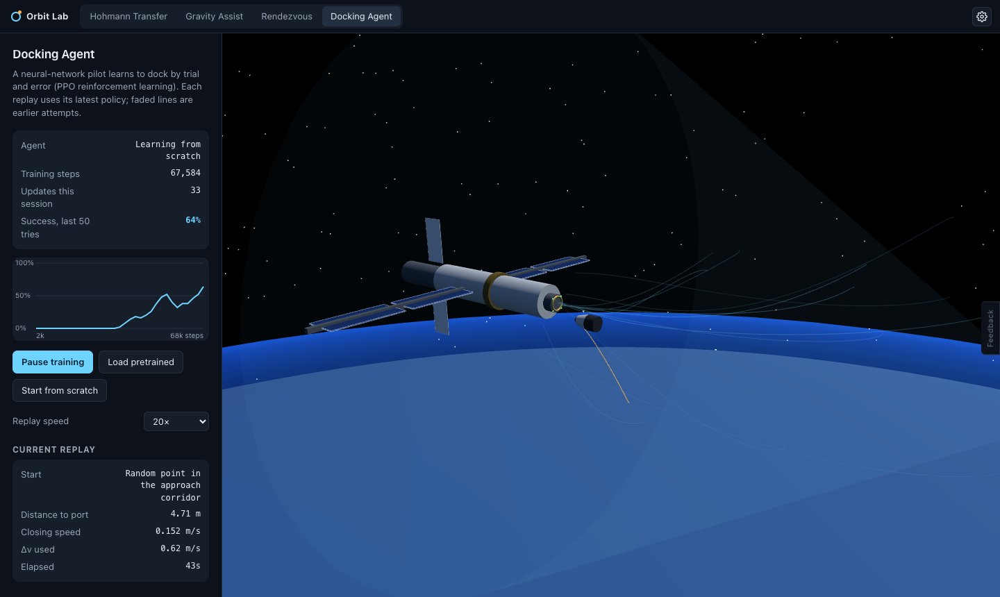
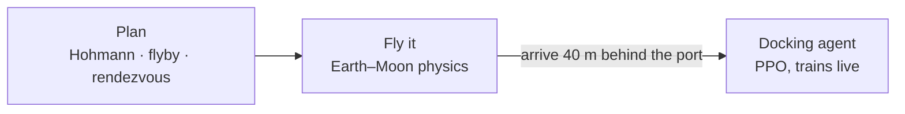

# Orbit Lab

A Mac app for playing with orbital mechanics in 3D: plan Hohmann transfers, lunar gravity assists and rendezvous burns, then watch a reinforcement-learning agent learn to dock with a space station.

| Hohmann Transfer | Gravity Assist |
|---|---|
|  |  |
| **Rendezvous** | **Docking Agent** |
|  |  |

- **[Try it in your browser](https://amalmehta.github.io/OrbitLab/)**
- **[How to set up, run and use it](docs/INSTRUCTIONS.md)**
- **[System design](docs/SYSTEM-DESIGN.md)**: architecture, physics, RL and trade-offs
- **[What's where](docs/FILE-STRUCTURE.md)**
