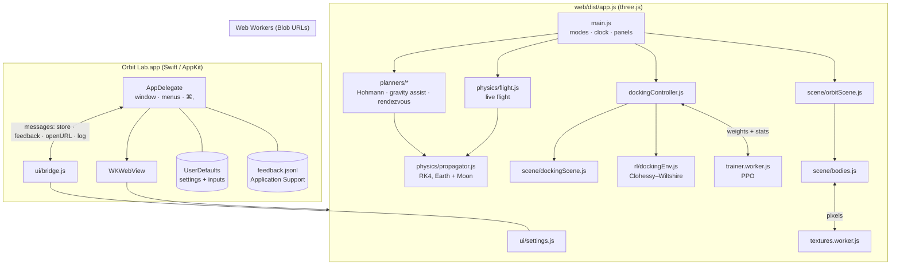

# Orbit Lab: System Design

Orbit Lab is a three.js app wrapped in a native macOS shell, and also published as a website on GitHub Pages. Everything runs locally: the physics, the planners, the 3D views and the reinforcement-learning trainer are all JavaScript inside one web view, and the Swift shell supplies the window, the menus and storage.

## Architecture

## Components

| Component | Job |
|---|---|
| **AppDelegate.swift** | Creates the window and WKWebView and loads the bundled page from the app's Resources. Builds the menu bar: Settings… ⌘,, View ▸ scenarios ⌘1–4, Play/Pause ⌘P, Help ▸ Send Feedback. Injects saved settings before the page loads, stores changes in UserDefaults, appends feedback to a JSONL file, opens external links in the default browser, and forwards page errors to the system log. |
| **main.js** | The app's controller. Switches modes, runs the render loop and the simulated clock (time warp, slowing for burns), fills the panels, and handles keyboard shortcuts. Exposes `window.orbitLab` for the native menu. |
| **physics/propagator.js** | Integrates the spacecraft with fixed-step RK4 in an Earth-centred frame: Earth, plus the Moon on a circular orbit, including the indirect term. The step adapts to about 1% of the local dynamical time of the nearest body. Impulsive burns are applied exactly at their timestamps. |
| **physics/flight.js** | A flight in progress: advances time, runs burns, keeps the trail, and re-predicts the path after each burn (through the remaining burns, then one orbit of the result). |
| **planners/hohmann.js** | Closed-form two-burn transfer. |
| **planners/gravityAssist.js** | Fixes the TLI Δv (a Hohmann to `apogeeFactor ×` the Moon's distance). Scans the burn time over one parking orbit (180 samples, coarse accuracy), then bisects where the signed closest approach crosses ±(R☾ + altitude). It labels each root as passing behind the Moon (trailing) or in front of it (leading), and measures v∞, turn angle and the Earth-relative energy change between entering and leaving the sphere of influence. |
| **planners/rendezvous.js** | Phasing wait from the analytic lead angle `π − n₂·TOF`. The transfer burn starts as a Hohmann and is refined by 2-D Newton iteration (prograde and radial Δv) on the full numerical model, so the chaser reaches an aim point 40 m behind the station. A matching burn then zeroes the relative velocity. `relativeLVLH` converts the result into the docking frame. |
| **rl/dockingEnv.js** | Clohessy–Wiltshire relative motion at 420 km. The agent sets three-axis acceleration (±0.04 m/s²). Reward: progress toward the port, minus a small effort cost, minus excess speed within 6 m. +10 for docking, −5 for a hard contact, hitting the hull or drifting past 120 m. 300 one-second steps. |
| **rl/mlp.js, rl/ppo.js** | A from-scratch MLP (tanh, manual backprop, Adam) and PPO: Gaussian policy with a learned log-σ, GAE(λ = 0.95), clipped objective, 8 parallel environments × 256 steps per update. Timeouts bootstrap from the critic. |
| **rl/trainer.worker.js** | Runs `Trainer.iterate()` in a loop and posts weights and stats after each update. |
| **dockingController.js** | Owns the policy used for replays, keeps it in sync with the worker, plays deterministic replays at the chosen speed, and records the success-rate history. |
| **scene/** | Two three.js scenes sharing one renderer with a logarithmic depth buffer: the Earth–Moon view (1 unit = 1,000 km) and the docking close-up (1 unit = 1 m). Textures are procedural and painted in workers. |
| **ui/** | Settings registry and sheet, feedback tab, training chart, and the native bridge with a localStorage fallback for browsers. |

## Main flows

**Plan → fly.** Moving a slider calls a planner and creates a paused `Flight` whose predicted path and burn markers are drawn. **Fly it** unpauses at the warp set in Settings. Each frame advances `warp × dt` seconds. When a burn is close, warp shrinks geometrically so the burn is visible. Executed burns show a toast, are logged, and trigger a new prediction.

**Rendezvous → docking hand-over.** After the matching burn, `relativeLVLH(chaser, station)` gives position and velocity in the station frame (about [0, −40, 0] m, near rest). **Hand over** switches to Docking mode and starts the next replay from exactly that state.

**Live training.** **Train** posts `start` to the worker. Each PPO iteration (2,048 samples) posts weights back, and the main thread copies them into its replay policy. Replays run the deterministic policy (the mean action), so what you see is the agent's current best guess. Ended replays leave faded trails, keeping the last 12.

**Website deploy.** A push to `main` runs `.github/workflows/pages.yml`: `npm ci`, `npm run build`, then `index.html`, `styles.css` and `dist/app.js` are uploaded as the Pages artifact and deployed to https://amalmehta.github.io/OrbitLab/. The page detects that it isn't inside the Mac app (`isMacApp()` is false) and uses localStorage for settings and feedback.

**Settings and feedback.** `settings.set` → `saveStored` → in the Mac app a `store` message to UserDefaults (injected as `window.__ORBIT_LAB_STORE__` on the next launch), in a browser localStorage.

## Where data lives

| Data | Where |
|---|---|
| Settings and last slider values | Mac app: UserDefaults (`com.amalmehta.orbitlab`, key `OrbitLabStore`). Browser: localStorage `orbitLab.*` |
| Feedback | `~/Library/Application Support/Orbit Lab/feedback.jsonl` (browser: localStorage) |
| Pretrained policy | `web/assets/pretrained-docking.json`, bundled into `app.js` at build time |
| Policies trained in the app | memory only; lost when the app quits |

## Key decisions and trade-offs

- **WKWebView shell instead of Electron.** The app is under 1 MB plus the bundle and feels native (real menus, ⌘,), and the same code becomes the website later. Cost: WebKit-only quirks, and `file://` loading, which rules out ES-module workers. Hence the next point.
- **Workers inlined as strings and started from Blob URLs.** This works from `file://` and keeps the app to one script. Cost: workers can't share module instances with the page.
- **Hand-written PPO instead of TensorFlow.js.** Zero dependencies, deterministic, and the same code trains in Node (tests, checkpoint) and in the app. Cost: slower than a GPU library, but the networks are tiny (6→48→48→3), so an update takes about 1 s.
- **Restricted three-body model with the Moon on a circular, equatorial orbit.** This captures real flyby behaviour and Moon perturbations, and planners and flights share one integrator, so plans fly true. Cost: no lunar inclination, eccentricity, Sun, J2 or drag.
- **Fixed-step RK4 with an adaptive step instead of an embedded adaptive method.** Simple and predictable, and lands exactly on burn times. Energy drift is under 10⁻⁷ per LEO orbit.
- **Gravity assist chosen by side, not by "gain or lose".** Arriving near apogee, the Moon-relative velocity points almost backwards, so either side *gains* energy. Labelling the choice "lose energy" would be wrong. The panel reports the true sign instead.
- **Clohessy–Wiltshire for docking, numerical orbits for rendezvous.** CW is exact enough within 100 m and cheap enough to train on. The hand-over converts the full-model state into the CW frame.
- **Website built in CI, not committed.** `web/dist/` stays out of git, and the Pages workflow builds it, so the site always matches `main`. Cost: a deploy needs a successful CI run (about a minute).
- **Procedural textures instead of image files.** WebGL can't read `file://` images in WKWebView (cross-origin), so textures are painted in workers. Cost: about 3–5 s on an Intel i9 before textures appear (plain colours until then).

## Testing

`npm test` runs Node's built-in test runner on the same modules the app uses:
- **Physics**: textbook LEO→GEO Δv (3.89 km/s), Moon sphere of influence, energy conservation, a numerically flown Hohmann ending circular, frame orthogonality, impact detection.
- **Planners**: each plan flown in the full Earth–Moon model. GEO reached within 50 km. Flyby altitude within 50 km. A trailing flyby gains energy and a fast leading flyby loses it. Rendezvous ends within 2 m of the aim point at under 0.1 m/s, even when flown in uneven frame-sized chunks the way the app does.
- **RL**: backprop checked against finite differences. The environment can't dock by drifting, and a simple controller does dock. PPO goes from scratch to ≥ 50% success in 28 updates. The shipped checkpoint docks ≥ 90% of the time on unseen starts.
- **UI**: checked by hand in Chrome and in the built Mac app. `scripts/screenshots.mjs` drives every mode end to end in headless Chrome.

## Known limits

- The Moon's orbit is circular and in the same plane as all spacecraft orbits. No plane changes.
- Burns are instantaneous. There's no finite-burn or fuel-mass model.
- The docking agent controls translation only (no attitude), and the port is a point with a speed limit.
- Training in the app isn't saved between launches.
- WebKit pauses rendering when the window is hidden, so flights pause too.
- Startup textures take a few seconds on older Macs.
- The website has no Mac menu, so Help and ⌘1–4 are Mac-only (the browser uses 1–4).
